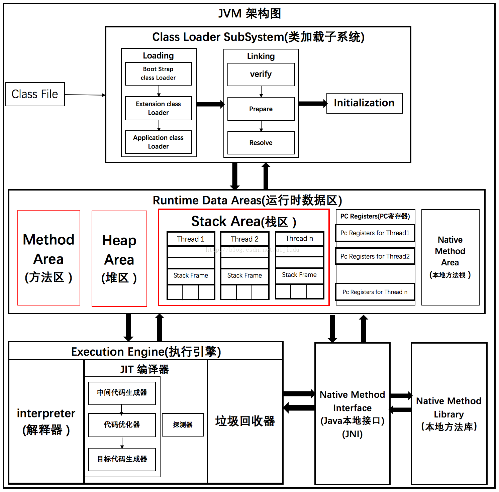
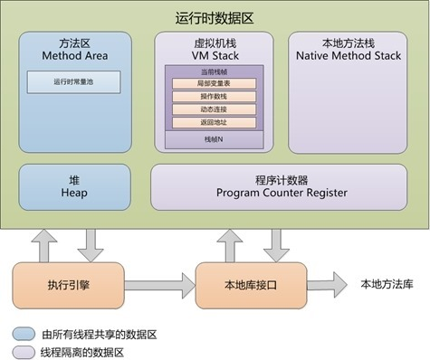

<font face="微软雅黑"> </font>
<center> </center>

<!-- more -->

[JavaSe Tutorial](https://docs.oracle.com/javase/tutorial/)
[Java工程师成神之路](https://hollischuang.github.io/toBeTopJavaer/#/)

- [JAVA](#java)
- [关键概念](#关键概念)
  - [泛型](#泛型)
  - [反射](#反射)
  - [函数式接口/Lambda表达式和Stream](#函数式接口lambda表达式和stream)
    - [Stream流式计算](#stream流式计算)
- [JVM内存结构](#jvm内存结构)
- [线程池](#线程池)
- [基础设施即代码](#基础设施即代码)
- [CSS3](#css3)
# JAVA

# 关键概念
## 泛型
Java的[泛型](https://www.liaoxuefeng.com/wiki/1252599548343744/1265104600263968)是采用擦拭法实现的,决定了泛型`<T>`：
1. 不能是基本类型，例如：int；
2. 不能获取带泛型类型的Class，例如：Pair<String>.class；
3. 不能判断带泛型类型的类型，例如：x instanceof Pair<String>；
4. 不能实例化T类型，例如：new T()。
5. 泛型方法要防止重复定义方法，例如：public boolean equals(T obj)；

6. 子类可以获取父类的泛型类型<T>。


## 反射
通过Class实例获取class信息.
JVM总是动态加载class，可以在运行期根据条件来控制加载class。JVM为每个加载的class及interface创建了对应的Class实例来保存class及interface的所有信息；

方法一：直接通过一个class的静态变量class获取：

```
Class cls = String.class;

```
方法二：通过该实例变量提供的getClass()方法获取：

```
String s = "Hello";
Class cls = s.getClass();

```
方法三：知道一个class的完整类名，可以通过静态方法Class.forName()获取：
```
Class cls = Class.forName("java.lang.String");

```

## 函数式接口/Lambda表达式和Stream


函数式编程（Functional Programming）是把函数作为基本运算单元，函数可以作为变量，可以接收函数，还可以返回函数。经常把支持函数式编程的编码风格称为Lambda表达式。

单方法接口被称为FunctionalInterface。接收FunctionalInterface作为参数的时候，可以把**实例化的匿名类**改写为`Lambda表达式`，能大大简化代码。Lambda表达式的参数和返回值均可由编译器自动推断。


### Stream流式计算
菜单 | java.util.List | java.util.stream
-|----------------|-----------------
元素 | 已分配并存储在内存 | 可能未分配，实时计算
用途 | 操作一组已存在的Java对象 | 惰性计算


# JVM内存结构





# 线程池

ThreadPoolExecutor

[Java线程池实现原理及其在美团业务中的实践](https://tech.meituan.com/2020/04/02/java-pooling-pratice-in-meituan.html)


# 基础设施即代码

>基础设施即代码是一种使用新的技术来构建和管理动态基础设施的方式。它把基础设施、工具和服务以及对基础设施的管理本身作为一个软件系统，采纳软件工程实践以结构化的安全的方式来管理对系统的变更。

[基础设施即代码](https://insights.thoughtworks.cn/nfrastructure-as-code/)有四项关键原则:
1. 再生性。环境中的任何元素可以轻松复制。
2. 一致性。无论何时，创建的环境各个元素的配置是完全相同的。
3. 快速反馈。能够频繁、容易地进行变更，并快速知道变更是否正确。
4. 可见性。所有对环境的变更应该容易理解、可审计、受版本控制。

基础设施即代码的目标是：
1. 标准化。 以代码来定义环境，实现开发环境、测试环境、生产环境的标准化。
2. 自动化。 以自动化工具来驱动代码准备环境。包括创建环境、更新环境以及销毁环境。
3. 可视化。 以监控来可视化环境信息。环境当前状态可视、环境变更历史可视、可追溯。


# CSS3
[mozilla HTML Tutorial](https://developer.mozilla.org/zh-CN/docs/Web/HTML#tools)
[w3cschools html tutorial](https://www.w3schools.com/html/html_intro.asp)
[CSS 参考](https://developer.mozilla.org/zh-CN/docs/Web/CSS/Reference)

[选择器](https://developer.mozilla.org/zh-CN/docs/Web/CSS/CSS_Selectors)
基本选择器：
1. 标签选择器：lable{}
2. 类选择器：.class{}
3. ID选择器:#id{}


优先级：标签选择器 < 类选择器 < ID选择器

层次选择器：
- 后代选择器：body p{}
- 子选择器：body>p{}
- 同级后一个：.class + label
- 同级后面所有：.class ~ label

伪类选择器：带`:`。


