<font face="微软雅黑"></font>

<!-- more -->


- [](#)
- [第一章 计算机网络和因特网](#第一章-计算机网络和因特网)
  - [网络核心](#网络核心)
  - [协议层次及服务模型](#协议层次及服务模型)
  - [OSI模型](#osi模型)
- [第二章 应用层](#第二章-应用层)
  - [应用层协议](#应用层协议)
  - [超文本传输协议](#超文本传输协议)
  - [电子邮件](#电子邮件)
  - [因特网目录服务](#因特网目录服务)
  - [文件分发](#文件分发)
  - [视频流和内容分发网](#视频流和内容分发网)
  - [套接字编程](#套接字编程)
- [第三章 运输层](#第三章-运输层)
  - [概述](#概述)
  - [多路复用与多路分解](#多路复用与多路分解)
  - [无连接运输](#无连接运输)
  - [可靠数据传输原理](#可靠数据传输原理)
  - [面向连接的运输](#面向连接的运输)
  - [TCP拥塞控制](#tcp拥塞控制)
- [第四章 网络层-数据平面](#第四章-网络层-数据平面)
  - [网络层概述](#网络层概述)
  - [路由器工作原理](#路由器工作原理)
  - [网际协议](#网际协议)
  - [通用转发](#通用转发)
- [第五章 网络层-控制平面](#第五章-网络层-控制平面)
  - [路由选择算法](#路由选择算法)
  - [自治系统内部的路由](#自治系统内部的路由)
  - [自治系统间路由选择协议-边界网关协议](#自治系统间路由选择协议-边界网关协议)
  - [控制平面](#控制平面)
  - [因特网控制报文协议](#因特网控制报文协议)
  - [网络管理](#网络管理)
- [第六章 链路层和局域网](#第六章-链路层和局域网)
  - [链路层概述](#链路层概述)
  - [差错检测和纠正技术](#差错检测和纠正技术)
  - [多路访问链路和协议](#多路访问链路和协议)
  - [交换局域网](#交换局域网)
  - [链路虚拟化](#链路虚拟化)
  - [数据中心网络](#数据中心网络)
  - [回顾-页面请求的历程](#回顾-页面请求的历程)

# 计算机网络 自顶而下方法

# 第一章 计算机网络和因特网
**协议**（protocol）：定义了在两个或者多个通信实体之间交换报文的格式和顺序，以及报文发送和/或接收一条报文或其它事件所采取的动作。

IETF：Internet Engineering Task Force，IETF的标准文档称为RFC（Request For Comment，请求评论）。

## 网络核心
通过网络链路和交换机移动数据有两种基本方法：分组交换和电路交换。

**分组交换**
分组交换机：路由器和链路层交换机。
存储转发、排队时延和分组丢失、转发表和路由选择协议、
特点：带宽共享；更简单、有效、实现成本更低。端到端延时不可预测。

因特网尽可能以实时方式交付分组，但不做保证。
**电路交换**
信息发送前，需要在发送方和接收方之间建立连接，路径上的交换机都将为该连接维护连接状态，同时预留恒定的带宽，以确保发送方能以恒定速率向接收方传输数据。

实现方式：频分复用（FDM）和时分复用（TDM）。
传统的电话网络即为电路交换网络。
## 协议层次及服务模型
分层：
- 优点：概念化和结构化。
- 缺点：功能冗余（如差错恢复）、层间依赖。


OSI开放系统互联模型。

  


TCP/IP 五层模型/因特网协议


比OSI缺少的两层留给开发者处理。

## OSI模型
各层所有的协议即为协议栈。

**应用层**
- 作用：为计算机用户提供接口，也为用户提供各种网络服务。
- 协议：HTTP、FTP、POP3、SMTP、DNS。
- 数据：报文

**表示层**
- 作用：使通信的应用程序能够解释交换数据的含义。提供各种用于应用层数据的编码和转换功能，确保一个系统的应用层发送的数据能被另外一个系统的应用层识别。

**会话层**
- 作用：建立、管理和终止表示层实体之间的通信会话。该层的通信由不同设备中的应用程序之间的服务请求和响应组成。

**传输层**
- 作用：在应用层端点之间传送报文。建立主机端到端的链接，为上层协议提供端到端的可靠和透明的数据传输服务，包括差错控制和流量控制等。
- 协议：TCP/UDP
- 数据：报文段

**网络层**
- 作用：将称为数据报的网络层分组从一台主机移动到另一台主机。通过IP寻址来建立两个节点之间的连接，为源端的运输层送来的分组选择合适的路由和交换节点，传输给目的端的运输层。
- 协议：IP网际协议
- 数据：数据报
- 路由器工作在网络层。

**数据链路层**
- 作用：将称为帧的链路层分组从一个网络元素移动到另一个网络元素。将比特组合成字节，再将字节组合成帧，使用链路层地址（以太网使用MAC地址）来访问介质，并进行差错检测。
- 协议：以太网、WIFI、电缆接入网的DOCSIS协议
- 数据：帧
- 交换机工作在链路层。

**物理层**
- 作用：将帧中的一个比特从一个节点移动到下一个节点。通过物理介质传输比特流。
- PDU（协议数据单元）：bit
- 设备：集线器HUB、中继器、调制解调器、网线、双绞线、同轴电缆
- 注意：没有寻址的概念


重要概念：封装、首部字段+有效载荷


病毒：一种需要某种形式的用户交互来感染用户设备的恶意软件。如包含恶意可执行代码的电子邮件附件。
蠕虫：无需任何明显用户交互就能进入设备的用户软件。


# 第二章 应用层
## 应用层协议
网络应用程序体系结构：客户-服务器体系结构（C-S） 和 对等体系结构（P2P）。

**进程通信：**
  1. 客户和服务器进程；
  2. 进程与计算机网络之间的接口：套接字是应用程序进程与运输层协议之间的应用程序编程接口（API）；
  3. 进程寻址：IP地址，端口号。

**运输层协议为应用程序提供的服务：**
  1. 可靠的数据传输
  2. 吞吐量
  3. 定时
  4. 安全性

**因特网提供的运输服务：**
  TCP服务：包括面向连接服务和可靠数据传输服务。
  UDP服务：不提供不必要服务的轻量级运输协议，仅提供最小服务。无连接，不可靠数据传输。
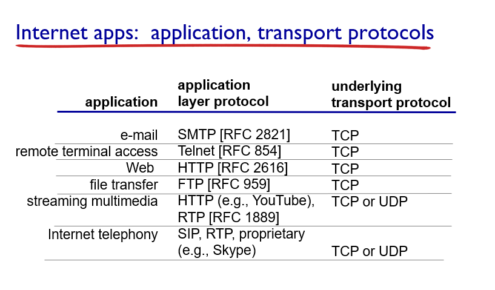

**应用层协议**定义了：
- 交换报文的类型
- 各种报文的语法
- 字段的语义
- 确定一个进程何时以及如何发送报文，对报文进行响应的规则

## 超文本传输协议

**HTTP**（超文本传输协议）：
Web的应用层协议。
定义了报文的结构以及客户和服务器进行报文交换的方式。
无状态协议，不保存关于客户的状态信息。
**Web页面**：一般含有一个HTML基本文件以及多个引用对象。

非持续连接：每个请求/相应对是经一个单独的TCP连接发送。
持续连接：所有请求相应经相同的TCP连接发送。

**HTTP报文的格式**
[参考文章](https://www.cnblogs.com/jiu0821/p/5641600.html)

请求报文:
- 请求行：方法、URL、HTTP版本
- 首部行
- 实体体

***
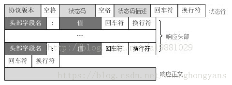
响应报文:
- 状态行：版本、状态码、相应状态信息。
- 首部行
- 实体体

***
**Cookies**:允许站点对用户进行跟踪。

**Web缓存器**：也叫代理服务器。CDN
  1. 减少对客户请求的时间；
  2. 减少接入链路到因特网的通信量；
  3. 降低因特网上的Web流量。

## 电子邮件
异步通信媒介。
组成：用户代理、邮件服务器、简单邮件传输协议（SMTP）。
**SMTP**：采用7比特ACSII。一般不使用中间邮件服务器发送邮件。

| 类别 | HTTP | SMTP |
|:---|:-------|:--------|
| 协议 | 拉协议 |推协议 |
| 数据格式 | 数据不受限制 | 7比特ASCII码格式 |
| 文档处理 | 把每个对象封装到它自己的HTTP的响应报文 | 所有对象放在一个报文内 |

**邮件访问协议：** 第三版邮局访问协议（POP3）、因特网邮件访问协议（IMAP）、HTTp

## 因特网目录服务
[参考文章](https://blog.csdn.net/tianxuhong/article/details/74922454)
DNS：Domain Name System，域名系统。
  - 提供主机名到IP地址的目录转换服务。
  - 主机别名
  - 邮件服务器别名
  - 负载分配
DNS是：
  1. 一个由分层的DNS服务器实现的分布式数据库；
  2. 一个使得主机能够查询分布式数据库的应用层协议，运行在UDP，端口53上。

**DNS工作机理概述**
  1. 分布式、层次数据库;递归查询和迭代查询
  2. DNS缓存：改善时延性能、减少在因特网上传输的DNS报文数量。
  3. DNS记录和报文


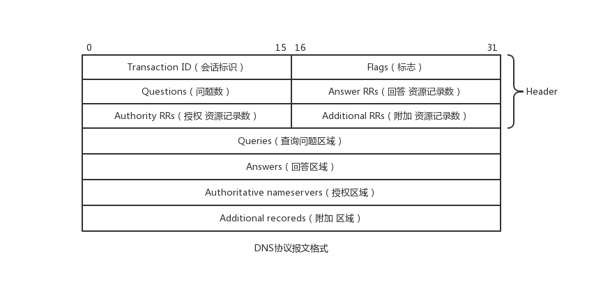

## 文件分发
P2P
自扩展性：对等方是比特的消费者也是重新分发者。
bitTorrent
## 视频流和内容分发网
**DASH**：经HTTP的动态适应流。采用速率决定算法。
**CDN**内容分发网:
利用DNS截获和重定向请求。
两种服务器安置原则：深入和邀请做客。
集群选择策略：动态地将客户定向到CDN中的某个服务器集群或者数据中心的机制。
学习案例：Netflix、YouTube

## 套接字编程
生成网络应用。TCP/UDP。

# 第三章 运输层

**多路分解和多路复用**将网络层提供的主机间交付服务扩展到运输层的进程间交付服务。

运输层协议只工作在端系统中，中间路由器仅作用于数据报的网络层字段。

最低限度的运输层服务：进程到进程的数据交付和差错检查（UDP只提供了这两种服务）。

## 多路复用与多路分解

IP网际协议提供尽力而为的服务，即不可靠服务。

- **多路分解**：将运输层报文段的数据交付到正确的套接字的工作。
- **多路复用**：在源主机从不同的套接字接收数据块，并为每个数据块封装上首部信息从而生产报文段，然后将报文段传递到网络层。


**套接字**
- UDP套接字：由一个二元组标识，包含一个目的IP和一个目的端口号。
- TCP套接字：由一个四元组标识，包含源IP地址、源端口号、目的IP地址、目的端口号。


## 无连接运输UDP
User Datagram Protocol

UDP的优点（相对于TCP）：
 1. 关于发送什么数据以及何时发送的应用层控制更为精细。TCP受拥塞控制机制的限制。

 2. 无需建立连接。TCP三次握手引入建立连接的时延。

 3. 无连接状态。TCP需在端系统中维护连接状态。

 4. 分组首部开销小。TCP-20字节，UDP-8字节。


使用UDP的应用可在自身中建立可靠性机制来实现可靠数据传输。如chrome中的QUIC协议。


**UDP报文段结构**
RFC 768

```
                  0      7 8     15 16    23 24    31
                 +--------+--------+--------+--------+
                 |     Source      |   Destination   |
                 |      Port       |      Port       |
                 +--------+--------+--------+--------+
                 |                 |                 |
                 |     Length      |    Checksum     |
                 +--------+--------+--------+--------+
                 |
                 |          data octets ...
                 +---------------- ...

                      User Datagram Header Format
```

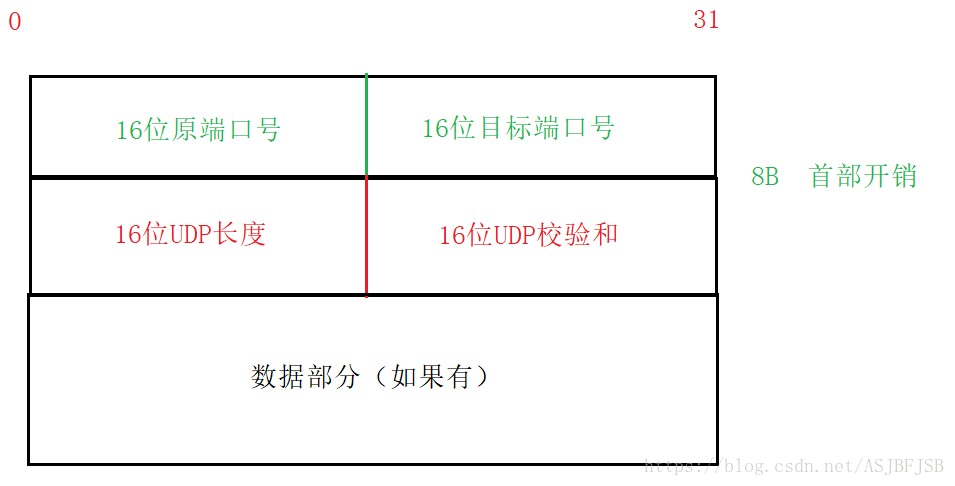

**UDP检验和**
在端到端基础上提供差错检测功能（无差错恢复）。在更低层上实现差错检查可能是冗余或无价值的。

校验和：对报文段中的数据，按16比特字求和并进行反码运算，溢出时回卷。

# 面向连接的运输TCP

## 可靠数据传输原理

推导出实现可靠数据传输的一些条件和方法。如序号、累计确认、检验和、超时/重传。


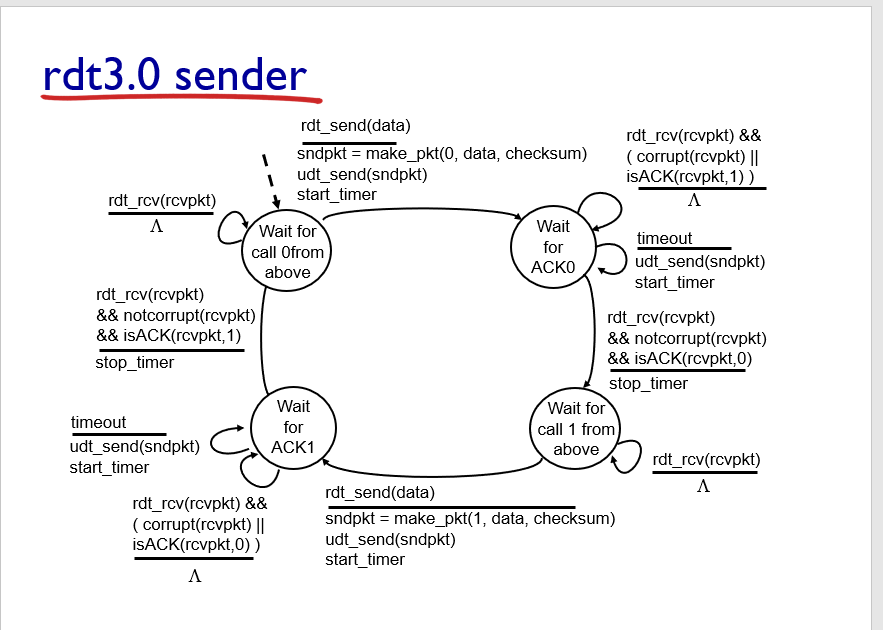

ARQ自动重传请求协议。停等协议。

差错恢复：回退N步（GBN）和选择重传（SR）。

## TCP介绍

TCP 在不可靠的（IP)端到端网络层之上实现可靠的数据传输协议。

涉及 **连接管理、流量控制、往返时间估计、可靠数据传送等。**

**TCP报文段结构**
RFC 793

```
    0                   1                   2                   3   
    0 1 2 3 4 5 6 7 8 9 0 1 2 3 4 5 6 7 8 9 0 1 2 3 4 5 6 7 8 9 0 1 
   +-+-+-+-+-+-+-+-+-+-+-+-+-+-+-+-+-+-+-+-+-+-+-+-+-+-+-+-+-+-+-+-+
   |          Source Port          |       Destination Port        |
   +-+-+-+-+-+-+-+-+-+-+-+-+-+-+-+-+-+-+-+-+-+-+-+-+-+-+-+-+-+-+-+-+
   |                        Sequence Number                        |
   +-+-+-+-+-+-+-+-+-+-+-+-+-+-+-+-+-+-+-+-+-+-+-+-+-+-+-+-+-+-+-+-+
   |                    Acknowledgment Number                      |
   +-+-+-+-+-+-+-+-+-+-+-+-+-+-+-+-+-+-+-+-+-+-+-+-+-+-+-+-+-+-+-+-+
   |  Data |           |U|A|P|R|S|F|                               |
   | Offset| Reserved  |R|C|S|S|Y|I|            Window             |
   |       |           |G|K|H|T|N|N|                               |
   +-+-+-+-+-+-+-+-+-+-+-+-+-+-+-+-+-+-+-+-+-+-+-+-+-+-+-+-+-+-+-+-+
   |           Checksum            |         Urgent Pointer        |
   +-+-+-+-+-+-+-+-+-+-+-+-+-+-+-+-+-+-+-+-+-+-+-+-+-+-+-+-+-+-+-+-+
   |                    Options                    |    Padding    |
   +-+-+-+-+-+-+-+-+-+-+-+-+-+-+-+-+-+-+-+-+-+-+-+-+-+-+-+-+-+-+-+-+
   |                             data                              |
   +-+-+-+-+-+-+-+-+-+-+-+-+-+-+-+-+-+-+-+-+-+-+-+-+-+-+-+-+-+-+-+-+
```

1. 序号：报文的首字节的字节流编号，初始为随机生成，两端各有一个（）。
2. 确认号：期望收到的下一字节的序号。
3. 接收窗口：指示接收方愿意接收的字节数量，用于流量控制。
4. 6比特标识字段：ACK、RST、SYN、FIN、PSH、URG。


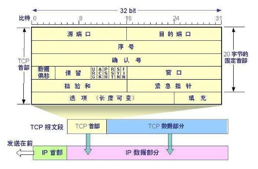


冗余ACK：接收方对已经接收到的最后一个按序字节数据进行重复确认，3次则认为已发生丢包，则执行快速重传。

**流量控制**
TCP连接两端分配了接收缓存。
发送方维护一个接收窗口cwnd，将未确认的数据量控制在rwnd内。（rwnd=0时需要发送一个单字节报文以从接收方获取最新的cwnd，避免阻塞）。

- 流量控制：避免发送方使接收方缓存溢出。
- 拥塞控制：因IP网络拥塞（路由器缓存溢出）而遏制发送发。


## TCP拥塞控制

**拥塞控制原理**
1. 端到端的拥塞控制
2. 网络辅助的拥塞控制ECN

TCP使用端到端的拥塞控制，因为IP层不向网络层提供显式的网络拥塞反馈。

**AIMD加性增、乘性减**：每个RTT内cwnd线性增加1MSS，然后出现3个冗余ACK事件时cwnd减半。
RTT(Round Trip Time)：一个连接的往返时间，即数据发送时刻到接收到确认的时刻的差值； 

MTU（Maximum Transmission Unit）：最大传输单元，MSS+头部40字节=1500字节。
MSS：Maximum Segment Size。1460字节。

**TCP拥塞算法：**
TCP拥塞控制仍在继续演化，如Reno、Vegas等算法。

慢启动和拥塞避免是强制部分。
1. 慢启动：每个RTT cwnd × 2 ，超时丢包时设置ssthresh=cwnd/2,cwnd=1，重新开始慢启动。当cwnd=ssthresh时，进入拥塞避免。冗余ack丢包时，进入快速恢复。
2. 拥塞避免：每个RTT cwnd+1 ,超时丢包时设置ssthresh=cwnd/2,cwnd=1。冗余ack丢包时，ssthresh=cwnd，进入快速恢复。
3. 快速恢复：对于引起TCP进入快速恢复状态的缺失报文段，每收到一个冗余ACK则cwnd+1 ，当丢失报文的ack到达时降低cwnd并进入拥塞避免。超时丢包时设置ssthresh=cwnd/2,cwnd=1，重新开始慢启动。

**公平性**
TCP趋于在竞争的多条TCP连接之间提供对一段瓶颈链路带宽的平等分享。

1. 拥有较小RTT的连接能够在链路空闲时更快抢到可用带宽，享有更高吞吐量。
2. 应用通常使用多个并行TCP连接。
3. UDP源可能压制TCP流量。

## 为什么需要三次握手
https://mp.weixin.qq.com/s/tH8RFmjrveOmgLvk9hmrkw

1. 阻止历史重复连接的初始化（主要原因）；
2. 同步双方的初始序列号；
3. 避免建立多个无效连接，造成资源浪费。

TCP通过观察分组丢失来推断拥塞。

## 相关协议
**ECN明确拥塞通告**：允许网络向TCP发送方和接收方发送拥塞信号。TCP可利用ECN。

- DCCP数据报拥塞控制协议：低开销、面向报文、类UDP的不可靠服务，可选ECN。
- DCTCP数据中心TCP：使用ECN以更好地支持短流和长流的混合流。
- SCTP流控制传输协议：允许几个不同应用层次的流复用到同一个连接。
- QUIC Quick UDP Internet Connection:在UDP之上，作为应用层协议实现重传、差错检查、快速连接建立、基于速率的拥塞控制算法，以提供可靠性。
- TFRC TCP友好速率控制：一种拥塞控制协议。

# 第四章 网络层-数据平面
## 网络层概述
**转发**：当一个分组到达路由器的某一条输入链路时，路由器必须将该分组移动到适当的输出链路。转发是在数据平面中中实现的唯一功能。转发表
**路由**：确定分组从源到目的地所采用的端到端路由的网络范围处理过程。在控制平面中实现。SDN方法、
**网络服务模型**：定义了分组在发送与接收端之间的端到端运输特性。
 1. 确保交付
 2. 具有时延上限的确保交付；
 3. 有序分组交付；
 4. 确保最小带宽；
 5. 安全性
网络层提供尽力而为服务。
**链路层交换机**：基于链路层帧中的首部字段进行转发。
**路由器**：基于网络层数据报中的首部字段进行转发。


## 路由器工作原理

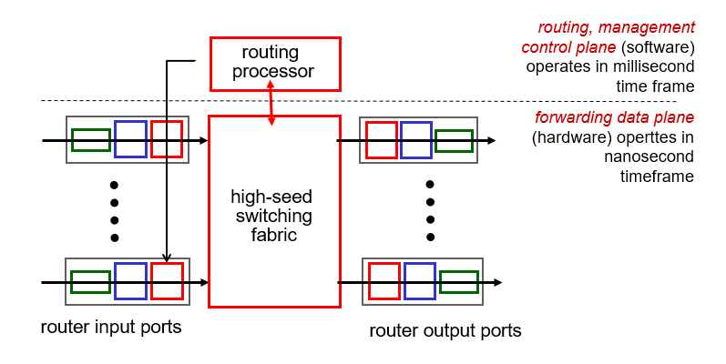

1. 输入端口
基于目的地的转发。
输入端口的线路端接功能与链路层处理实现了用于各个输入链路的物理层和链路层。
2. 交换结构
经内存交换、经总线交换、经互联网络交换
3. 输出端口
4. 路由选择处理器

**分组调度**
 1. 先进先出（FIFO，FCFS）
 2. 优先权排队
 3. 循环和加权公平排队

## 网际协议
**IPv4数据报格式**
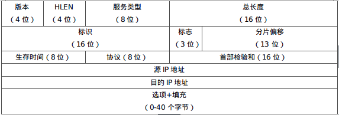
**IPv4数据报分片**
链路层协议的MTU严格限制IP数据报的长度。
一个链路层能承载的最大数据量叫做最大传送单元ＭＴＵ。
**IPv4 编址**
主机与物理链路之间的边界叫做**接口**。一个IP地址与一个接口相关联。点分十进制。子网与子网掩码。无类别域间路由选择CIDR：a.b.c.d/x

**获取主机地址：动态主机配置协议**DHCP

**网络地址转换**NAT
使用NAT路由器上的一张NAT转换表。

**IPv6**
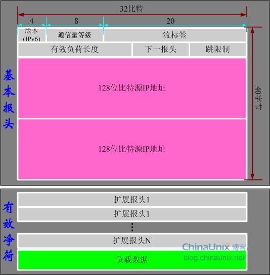
无 分片/组装、首部检验和、选项

## 通用转发
每台分组交换机包含一张匹配加动作表。该表示由远程控制器计算和分发的。
**流表**包含：首部字段值的集合、计数器集合、动作集合。

# 第五章 网络层-控制平面
每路由控制：转发表（基于目的地转发）
逻辑集中式控制：流表（通用转发）

## 路由选择算法
1. 集中式路由选择算法：
    具有全局状态信息的算法被称为链路状态（LS）算法。Dijkstra算法
2. 分散式路有选择算法：
    每个节点维护到网络中所有其它节点的开销估计的向量被称为距离向量（DV）算法。
LS与DV比较：报文复杂性、收敛速度、健壮性。

## 自治系统内部的路由
OSPF：开放最短路优先。是一种链路状态协议，他使用洪泛链路状态信息和Dijkstra最低开销路径算法。
## 自治系统间路由选择协议-边界网关协议
**BGP边界网关协议**
 1. 从邻居AS（自治系统）获得前缀（——CIDR）的可达信息；
 2. 确定到该前缀的“最好的”路由器。

**前缀及其属性称为路由。**
 - AS-PATH属性包含了通告已经通过的AS列表。
 - NEXT-SHOP是AS-PATH起始的路由接口的IP地址。
**路由选择**
热土豆路由选择：用尽可能低的开销送出其AS；
**BGP路由表**
**IP任播**

## 控制平面
[SDN体系结构的特征：](https://www.cnblogs.com/born2run/p/9581417.html)
 1. 基于流的转发
 2. 数据平面与控制平面分离
 3. 网络控制功能：位于数据平面交换机外部
 4. 可编程的网络
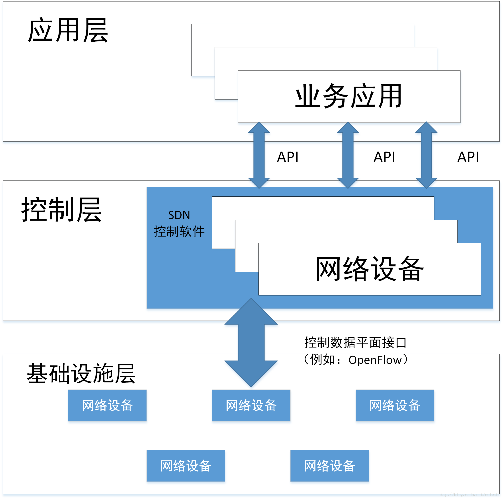

## 因特网控制报文协议
ICMP通常被认为是IP的一部分，但是从体系结构上来讲，它位于IP之上。因为ICMP报文是作为IP有效载荷承载的。
ICMP最典型的用途是差错报告。

## 网络管理
SNMP简单网络管理协议v2：是一个应用层协议，用于在管理服务器和代表管理服务器执行的代理之间传递管理控制和信息报文。
SNMP代理向管理服务器发送一种非请求报文，该报文被称为陷阱报文。


# 第六章 链路层和局域网
## 链路层概述
**链路层提供的服务**
- 成帧
- 链路介入：媒体访问控制（MAC）
- 可靠交付
- 差错检测和纠正
链路层的主体部分是在**网络适配器**中实现的，网络适配器又称为网络接口卡（NIC）。位于网络适配器核心的是链路层控制器，该控制器是一个实现许多链路层服务的专用芯片。
链路层是硬件与软件的结合体。

## 差错检测和纠正技术
差错检测和纠正比特（EDC）
1. 奇偶校验
2. 检验和方法：运输层
3. 循环冗余检测：链路层

## 多路访问链路和协议
**广播链路**：多个发送和接收节点连接到相同的、单一的、共享的广播信道上。当任何一个节点传输一个帧，信道广播该帧，每个其他节点都收到一个副本。以太网和无线局域网是广播链路层技术的例子。

**信道划分协议**：时分多路复用（TDM）、频分多路复用（FDM）、码分多址（CDMA）
**随机接入协议：**重发该帧之前等待一个随机时延。时隙ALOHA、ALOHA、载波侦听多路访问（CSMA）、带碰撞检测的载波侦听多路访问（CDMS/CD）
**轮流协议：**轮询协议、令牌传递协议

用于电缆因特网接入的链路层协议：DOCSIS

## 交换局域网
**链路层寻址和ARP**
MAC地址：又称LAN地址、物理地址。6字节。网络适配器具有的链路层地址。
ARP：地址解析协议，网络层地址和链路层地址之间的转换。ARP表。

**以太网**
以太网帧结构
 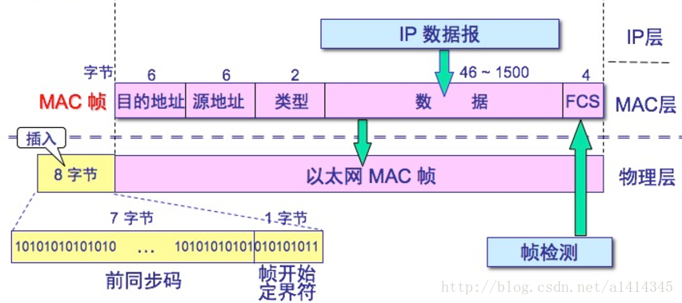
以太网技术向网络层提供无连接、不可靠服务。
**交换机**
流量隔离：路由器、交换机
即插即用：集线器、交换机
优化路由：路由器

## 链路虚拟化
多协议标签交换（MPLS）:一种在开放的通信网上利用标签引导数据高速、高效传输的新技术。多协议的含义是指MPLS不但可以支持多种网络层层面上的协议，还可以兼容第二层的多种数据链路层技术。

 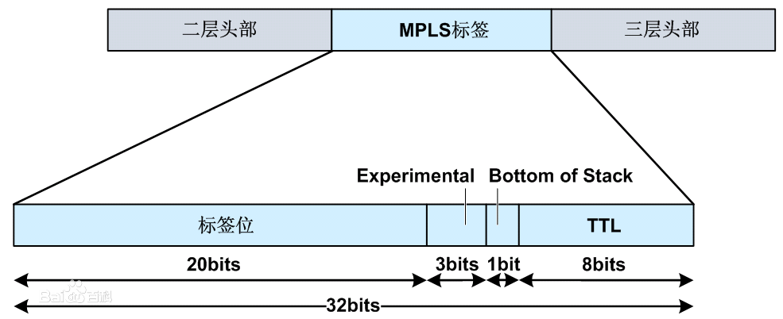

基于标签执行交换、流量管理能力、执行MPLS转发路径的快速恢复、虚拟专用网（VPN）

## 数据中心网络
 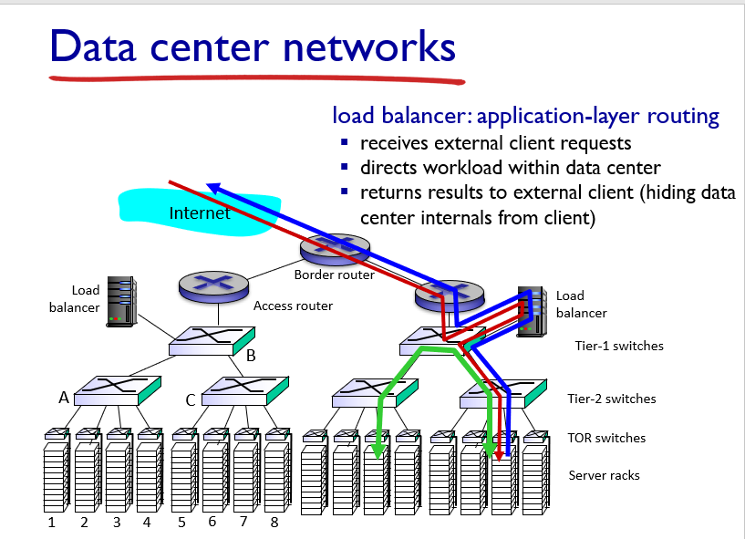

## 回顾-页面请求的历程
待补充


