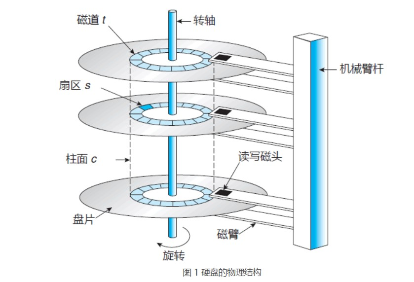
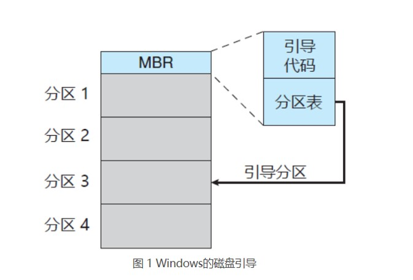
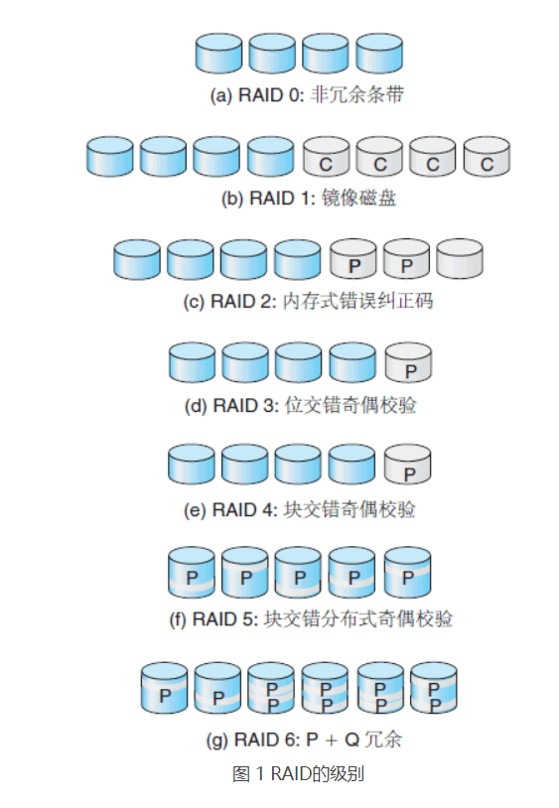

 大容量存储结构 

<!-- more -->

 [本文地址](https://tiandaochouqin1.github.io/OSC-Chapter12-13/) 

<!-- TOC -->

- [大容量存储结构](#%e5%a4%a7%e5%ae%b9%e9%87%8f%e5%ad%98%e5%82%a8%e7%bb%93%e6%9e%84)

<!-- /TOC -->
# 大容量存储结构
文件系统从逻辑上包括三个部分。第十章讨论了文件系统的用户和程序员接口；第十一章描述了操作系统实现这种接口的内部数据结构和算法；本章讨论文件系统的最低层：次级存储结构。
CPU不可直接读取次级存储装置。

**物理结构**
**磁盘或硬盘：**刺头附着在磁臂上，磁臂将所有磁头作为一个整体而移动。盘片表面逻辑地划分为圆形磁道，再细分为扇区。同一磁臂位置的磁道集合形成了柱面。

RPM：每分钟转速。
定位时间或随机访问时间：包括寻道时间（移动磁臂到所需柱面的所需时间）和旋转延迟（旋转磁臂到所需扇区的所需时间）。
磁盘驱动器通过I/O总线链接到计算机。
可用总线包括硬盘接口技术（ATA）、串行ATA（SATA）、外部串行ATA（eSATA）、通用串口总线（USB）、光纤通道（FC）。
数据传输总线由称为控制器的转么电子处理器来进行。主机控制器和磁盘控制器。
**固态硬盘SSD**
无磁头，更可靠；无寻道时间或延迟；电源消耗少。可设计成直接连接到系统总线（例如ＰＣＩ）。
**磁带**：早期的外存媒介。

现代磁盘驱动器的结构是一个大的一维的逻辑磁盘块的数组。一位逻辑数组依次映射到磁盘扇区。

***
**磁盘连接**
* 主机连接存储：通过本地I/O端口来访问存储。IDE、ATA、SATA、FC、FC仲裁环路（FC-AL)。
* 网络连接存储ＮＡＳ：客户通过远程过程调用ＲＰＣ，如ＵＮＩＸ的ＮＦＳ或Ｗｉｎｄｏｗｓ的ＣＩＦＳ，访问网络连接存储。ＲＰＣ通过IP网络的TCP/UDP来进行。消耗数据网络带宽从未增加网络通信延迟。
* 存储区域网络：采用存储协议连接服务器和存储单元。灵活性：多个主机和多个存储阵列可以连接到同一个SAN，存储可以动态分配到主机。
***

**磁盘调度**
磁盘调度算法可以改善有效带宽、响应时间均值、响应时间偏差等。
* FCFS：
* SSTF:最短寻道时间优先，本质上是一种最短作业优先（SJF）调度。
* SCAN调度：电梯算法，磁臂从磁盘的一段开始向另一端移动并处理每个柱面请求，当到达磁盘的另一端时，磁头移动方向反转。
* C-SCAN：循环扫描，是SCAN的一个变种。当磁头到达另一端时，立即返回磁盘的开头。将柱面作为一个环链。
* LOOK调度：磁臂只需移动到一个方向的最远请求为止。包括LOOK和C-LOOK调度。
SSTF和LOOK是默认算法的合理选择。
固态硬盘无移动部件，算法性能差异小，常使用FCFS策略。
***

**磁盘管理**
**格式化**：
**低级格式化或物理格式化：**为每个扇区使用特殊的数据结构，填充磁盘。每个扇区的数据结构由头部、数据区域和尾部组成。头部和尾部包含了一些磁盘控制器的实用新型，如扇区号和纠错代码。
将磁盘分为有柱面组成的多个分区，操作系统可以将每个分区作为一个单独的磁盘。
**高级格式化或逻辑格式化：**包括对主引导记录中分区表相应区域的重写、根据用户选定的文件系统，将初始文件系统数据结构存储到磁盘上。
**引导块**
自举程序bootstrap：位于只读存储器ROM。初始化系统的所有部分，从CPU寄存器到设备控制器和内存，接着启动操作系统。
启动磁盘或系统磁盘：具有启动分区的磁盘。
以Windows为例：引导首先运行驻留在系统ROM内存中的代码，此代码指示系统从MBR中读取引导代码，当系统找到引导分区，它读取分区的第一个扇区，称为引导扇区，并继续加载各种子系统和系统服务。

**坏块**：扇区备用、扇区转寄、扇区滑动。
***
**交换空间管理**
交换空间的位置有两个：普通文件系统或专用的原始磁盘分区。
系统通常绕过文件系统，使用原始磁盘来进行调页I/O访问。

***
**RAID结构**
磁盘冗余阵列RAID技术，用于处理性能与可靠性问题。
通过冗余提高可靠性。
通过并行提高性能。
位级分条：将每个字节分散在多个磁盘上。
块及分条：文件的块分散在多个磁盘上。

[基本RAID级别介绍](https://zh.wikipedia.org/wiki/RAID)

***

