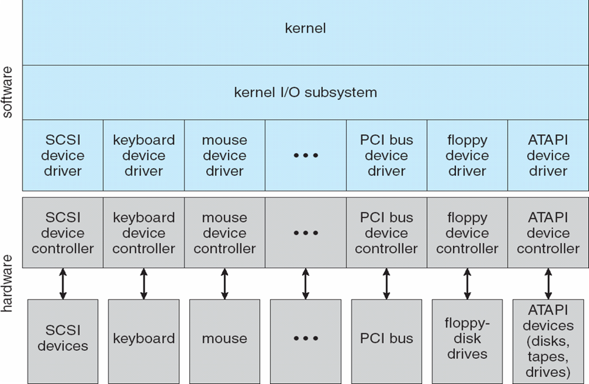
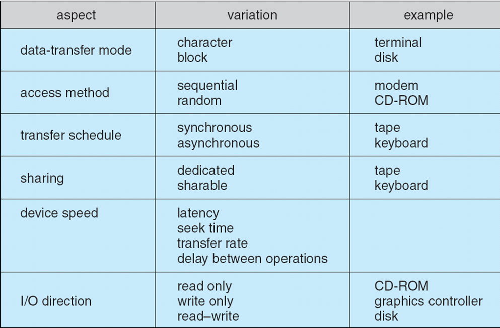

 

I/O系统 

<!-- more -->

 [本文地址](https://tiandaochouqin1.github.io/OSC-Chapter13/) 

<!-- TOC -->

- [I/O系统](#io系统)

<!-- /TOC -->

# I/O系统

I/O设备的基本要素：总线、设备控制器和设备本身。
***
设备与计算机的通信通过一个连接点或**端口**。如果设备共享一组通用线路，则这种连接为总线。
**总线：**是一组线路和通过线路传输信息的严格定义的一个协议。消息是通过施加线路的具有一定时序的电压模式来传递的。
PCI总线将处理器内存子系统连接到快速设备。扩展总线连接相对较慢的设备，如键盘和串口和USB端口。

SCSI：小型计算机系统接口。
**控制器：**是可以操作端口、总线或设备的一组电子器件。
I/O端口通常由四个寄存器组成，即状态、控制、数据输入和数据输出寄存器。
* 数据输入寄存器被主机读出以获得数据。
* 数据输出寄存器被主机写入以发送数据。
* 状态寄存器包含一些主机可以读取的位，例如当前命令是否完成、数据输入寄存器中是否由数据可以读取、是否出现设备故障等。
* 控制寄存器可由主机写入，以便启动命令或更改设备模式。

**轮询**：采用2个位协调控制器与主机之间的生产者与消费者关系。控制器工作忙时就置忙位，可以接受下一个命令时就清忙位。主机通过命令寄存器的命令就绪位来表示意愿。主机一直读取状态就绪位，直到忙位被清楚。可能产生低效问题。
**中断**：能让设备通知CPU的硬件机制称为中断。
设备控制器通过中断请求线发送信号而引起中断，CPU捕获中断并且分派到中断处理程序，中断处理程序通过处理设备来清除中断。
中断处理程序确定中断原因，执行必要处理，执行状态恢复，并执行返回终端指令以便CPU回到中断前的执行状态。

非屏蔽中断：保留用于诸如不可恢复的内存错误等事件。
可屏蔽中断：在执行不得中断的关键指令序列之前，可由CPU关闭。
中断向量：包含专门的中断处理程序的内存地址。目的是，单个中断处理不在需要搜索所有可能中断源。中断链技术。

中断机制可以用于吃力各种异常，实现系统调用，管理内核的控制流等

**直接内存访问**
**程序控制I/O（PIO）：**通过通用处理器来观察状态位并按字节来发送数据到控制器寄存器。
**直接内存访问（DMA）：**主机将DMA命令块写到内存，CPU将命令块的地址写到DMA控制器器，DMA控制器直接操作内存总线，将地址放到总线，在没有主CPU的帮助的情况下执行传输。该命令块包含传输来源地址的指针、传输目标地址的指针、传输的字节数。
DMA控制器和设备控制器之间的握手，通过一对称为DMA请求和DMA确认的线路来进行。

***

**应用程序I/O接口**
设备驱动程序层：为内核I/O子系统隐藏设备控制器之间的差异；就如同I/O系统调用封装设备的行为。

**块与字符设备**
块设备接口：为磁盘驱动器和其他基于块设备的访问规定了所需的各方面。基本行为：read()、write()、seek()。
字符流接口：如键盘。应用程序无法预计这些输入。get()/put()。

内存映射文件的访问可以在块设备驱动程序上。内存映射接口提供通过内存的字节数组来访问磁盘存储，而不提供读和写操作。

**网络设备**：套接字接口。select()。

**时钟与定时器**
可编程间隔定时器：测量经过时间和触发操作的硬件。

**非阻塞与异步I/O**

**向量I/O**：允许系统调用，来执行涉及多个位置的多个I/O操作。

***

**内核I/O子系统**
内核I/O子系统提供与I/O相关的许多服务。
* I/O调度
* 缓冲：缓冲区是一块内存区域，用于保存在两个设备之间或在设备和应用程序之间传输的数据。
    * 处理数据流的生产者与消费者之间速度的不匹配；双缓冲解耦数据的生产者和消费者，放松两者之间的时序要求。
    * 协调传输大小不一数据的设备；缓冲区大量用于消息的分段和重组；
    * 支持应用程序I/O的复制语义。
* 缓存：保存数据副本的高速内存区域。
    * 缓冲可以保存数据项的唯一现有副本
    * 缓存只提供了一个位于其他地方的数据项的更快存储副本。
* 假脱机与设备预留：假脱机是保存设备输出的缓冲区，这些设备，如打印机，不能接收交叉的数据流。
* 错误处理：I/O系统调用通常返回一位的调用状态信息，以表示成功或失败。
* I/O保护：定义所有I/O指令为特权指令，防止用户执行非法I/O；保护任何内存映射和I/O端口内存位置以便阻止用户访问。
* 名称转换：在硬件设备和应用程序的符号文件名称之间建立连接。它包括多级映射，以便映射文件的字符串名称到特定设备驱动器和设备地址，然后到I/O端口和总线控制器的物理地址。

***
**流**提供了一种框架的实现和方法，以采用模块化和增量的方法来编写设备驱动程序和网络协议。通过流，驱动程序可以堆叠，数据可以按单项和双向来传输和处理。

**性能**
由于物理设备和应用程序之间的多个软件层，I/O系统调用消耗的CPU周期较多。
这些层意味着多种开销：穿过内核保护边界的上下文切换、I/O设备的信号和中断处理、内核缓冲和应用程序空间之间的数据复制所需的CPU和内存系统的负载。

***

