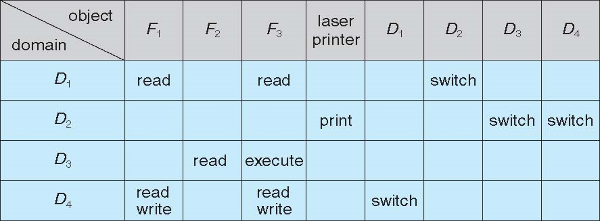
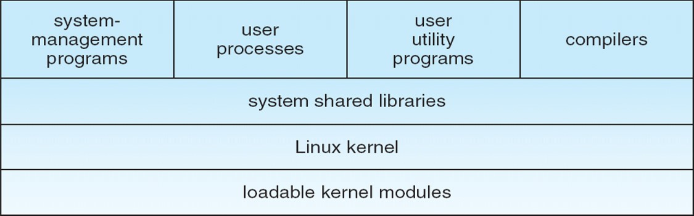
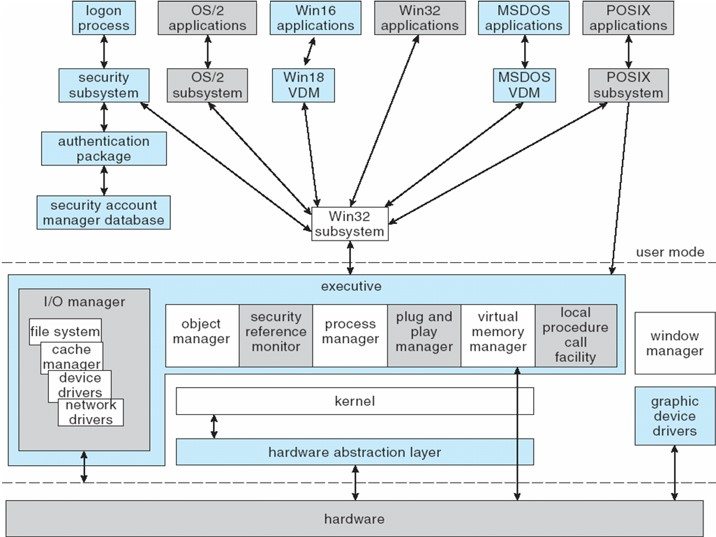

系统保护、系统安全 

<!-- more -->

 [本文地址](https://tiandaochouqin1.github.io/OSC-Chapter14-15/) 

<!-- TOC -->

- [系统保护](#%e7%b3%bb%e7%bb%9f%e4%bf%9d%e6%8a%a4)
- [系统安全](#%e7%b3%bb%e7%bb%9f%e5%ae%89%e5%85%a8)

<!-- /TOC -->

# 系统保护
**保护机制**通过限制程序、进程或用户程序访问计算机系统的资源。这种机制必须提供指定需要施加的控制以及强制执行它们的方式和手段。
保护的目的：防止用户有意地、恶意地违反访问限制；确保系统的活动程序组件按照规定策略来使用系统资源。
机制决定如何做，策略决定做什么。

**保护原则**：最低特权原则，规定程序、用户甚至系统只能拥有足够特权以便执行任务。

计算机包含许多对象，它们需要加以保护，防止滥用。对象可以是硬件（如内存、CPU时间、I/O设备），或是软件（如文件、程序、信号量）。

**保护域**
域是访问权限的集合。
进程在域中执行，可以采用域内的任何访问权限啦访问或操作对象。在整个生命周期中，进程可以绑定到一个保护域，也可以允许从一个保护域切换到另一个保护域。

**访问矩阵**
访问矩阵是一个通用的保护模型，它提供了一种保护机制，而无需对系统或用户施加特定的保护策略。行表示域，列表示对象。

策略和机制的分离是重要的设计原则。
* switch切换：切换进程从一个域到另一个域。
* copy复制：复制访问矩阵的一个域的访问权限到另外一个。
* owner所有者：增加新权限和取消某些权限。
* control控制：修改行内的条目。
复制与所有者权限允许进程修改列内的条目。

**访问矩阵的实现**
访问矩阵是稀疏的。
它的实现采用每个对象关联的访问列表或每个域关联的能力列表。
通过将域和访问矩阵本身视为对象，访问矩阵模型可以包括动态保护。
动态访问模型的访问权限撤销，采用访问列表（而非能力列表）方案更易实现。

实际系统比通用模型具有更多限制，并倾向于仅为文件提供保护。UNIX是一个代表。

与操作系统提供的相比，基于语言的保护位请求和特权提供了更细粒度的仲裁。

# 系统安全

保护是一个内部问题。而安全那必须考虑计算机系统和系统使用环境，如人员、大楼、企业、贵重物品和威胁等。
安全机制确保系统用户的身份认证，保护系统的物理资源和存储信息（包括数据和代码）的完整性。
安全系统防止未授权的访问、数据的恶意破坏或更改以及不一致的意外引入等。
与防止数据的恶意访问相比，防止数据一致性的丢失更加容易。

安全违规：
* 违反机密：未经授权的数据读取；
* 违反诚信：未经授权的数据修改；
* 违反可用：未经授权的数据破坏；
* 盗窃服务：未经授权的资源使用；
* 拒绝服务：阻止系统的合法使用，Dos。

伪装、重播攻击、消息篡改、中间人攻击、会话劫持。

需要从四个层次上采取安全措施：物理、人员、操作系统、网络。

***
**程序威胁**
* 特洛伊木马：误用环境的代码段。变体包括模拟登录程序、间谍软件。
* 后门：程序或系统设计人员留下的只有他自己才能使用的软件漏洞。
* 逻辑炸弹：当满足预先定义的一组参数时，就会创建安全漏洞。
* 堆栈和缓冲区溢出：允许成功的攻击者改变系统访问的级别。
* 病毒：嵌在合法程序中的代码片段。可自我是指，旨在感染其他程序。
    * 文件病毒：追加自身到文件。
    * 引导病毒：感染系统的引导扇区，它执行在系统引导时，在操作系统之前。
    * 宏病毒、源代码病毒、多态病毒、加密病毒、隐性病毒、隧道病毒、复合病毒、装甲病毒等

***
**系统和网络的威胁**
* 蠕虫：包括抓钩（引导、向量）和主程序。利用网络进行复制和传播，传染途径是荣国网络和电子邮件。
* 端口扫描：一种为了攻击系统而检测漏洞的方法。
* 拒绝服务：破坏系统或设施的合法使用。其通常是基于网络的。第一类攻击是占用非常多的设施资源，一直任何有用的工作实质上都不能做。第二类攻击设计破坏网络设施。不可能防止拒绝服务攻击。DDos分布式拒绝服务攻击。

**作为安全工具的密码术**
加密限制数据接收者的域，认证限制数据接收者的域。
加密用于提供存储或传输数据的机密性。
对称加密：共享秘钥。数据加密标准DES、高级加密标准AES、流加密（RC4）。
非对称加密：提供公钥和私钥。仅用于加密少量数据，用于认证、保密和秘钥的分发。
认证结合哈希，可以证明数据没有被更改。

认证算法：
* 消息认证码：采用对称加密
* 数字签名算法：采用非对称加密

密码术可以插入到OSI模型的任何层。
网络层安全标准IPSec，定义了IP包格式。IPSec使用对称加密。
SSL在传输层提供安全。

**用户认证**
用于识别系统的合法用户。除了标准的用户名和密码保护，由多种认证方式。例如，一次性密码、双重因素认证、多重因素认证。

预防或检测安全事故的方法包括：入侵检测系统、防病毒软件、系统事件的审计和记录、系统软件更改的监控、系统调用监控和防火墙。

***

***

