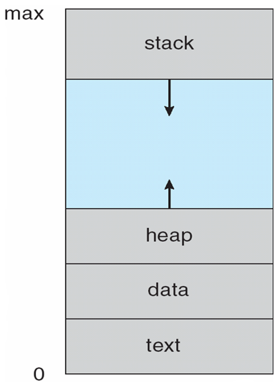

 

 进程

<!-- more -->

<!-- TOC -->

- [进程](#进程)
  - [进程的概念](#进程的概念)
  - [进程调度](#进程调度)
  - [进程运行](#进程运行)
  - [进程间通信](#进程间通信)
  - [进程间通信例子](#进程间通信例子)
  - [客户机/服务器通信](#客户机服务器通信)

<!-- /TOC -->
 
# 进程

## 进程的概念
进程不只是程序代码，程序代码有时称为文本段。进程还包括当前活动，如程序计数器的值和处理器寄存器的内容等。进程还包括：进程堆栈和数据段，还可能包括堆。**进程的内存结构**如图所示：
  
* 文本：程序代码。
* 堆栈：临时数据，如如函数参数、返回地址和局部变量。
* 数据段：包括全局变量。
* 堆：进程运行时动态分配的内存。

**进程控制块（PCB）**：也称为任务控制块。包含许多与特定进程相关的信息：
* 进程状态：新的、就绪、运行、等待、终止。
* 程序计数器：表示进程将要执行的下一个指令的地址。
* CPU寄存器：包括累加寄存器、索引寄存器、堆栈寄存器、通用寄存器和其他条件码寄存器。
* CPU调度信息：包括进程优先级、调度队列的指针和其他调度参数。
* 内存管理信息：包括基地址和界限地址寄存器的值、页表或段表。
* 记账信息：包括CPU时间、实际使用时间、时间期限、记账数据、作业或进程数量。
* I/O状态信息：包括分配给进程的I/O设备列表和打开文件列表。
在支持线程的系统中，PCB被扩展到每个线程的信息。

  

## 进程调度
**多道程序设计**的目标是，无论何时都有进程运行，从而最大化CPU利用率。
**分时系统**的目的是，在进程之间快速切换CPU，以便用户在程序运行时能与其交互。
为了满足这些目标，**进程调度**选择一个可用进程到CPU上执行。

**作业队列**：包括系统内的所有进程。
**就绪队列**：驻留在内存中的、就绪的、等待运行的进程。通常用链表实现，其头结点有两个指针，用于指向列表的第一个和最后一PCB块；每个PCB还包含一个指向就绪队列的下一个PCB的指针。
**设备队列**：等待特定的I/O设备的进程列表。
**长期调度程序**（作业调度程序）从缓冲池中选择进程，加到内存以便执行。短期调度程序（CPU调度程序）从准备执行的进程中选择进程，并分配CPU。
  

**中期调度程序**可将进程从内存中移出，从而降低多道程序度。之后程序可被重新调入内存，并从中断处继续执行。
进程可分为：I/O密集型进程和CPU密集型进程。
**上下文切换**：切换CPU到另外一个进程需要保存当前进程的状态和恢复另外一个进程的状态。

***  

## 进程运行
每个新进程可以创建其他进程，从而形成**进程树**。
对进城的识别采用唯一的进程标识符（pid）。
当进程创建新进程时，有两种执行可能：
* 父进程与子进程并发执行；
* 父进程等待，直到某个或全部子进程执行完。
新进程的地址空间也有两种可能：
* 子进程是父进程的复制品（它具有与父进程相同的程序和数据）；、
* 子进程加载另外一个新的程序。

***
UNIX通过系统调用**fork()**创建的新进程的地址空间复制原来进程的地址空间。这种机制允许父进程与子进程轻松通信。
两个进程都继续执行系统调用fork()之后的命令。通常在系统调用fork()之后，有个进程调用**exec（）**，以用新程序来取代进程的内存空间。这两个进程能互相通信。

 
 
Windows进程创建采用Windows API函数**CreateProcess（）**，类似于fork（），CreateProcess（）在进程创建时要求讲一个特定的程序加载到子进程的地址空间。
进程终止：当进程完成执行最后语句并且通过系统调用exit()请求操作系统删除自身时，进程终止。进程返回状态值到父进程（通过系统调用exit（））；所有进程资源，如物理和虚拟内存、打开文件和I/O缓存区等，会由操作系统释放。
级联终止：不允许子进程在父进程已终止的情况下存在。
僵尸进程：进程已终止，但父进程未调用exit（）。
孤儿进程：其父进程没有调用wait（）就终止，以致子进程称为孤儿进程。

*** 

## 进程间通信
协作进程：信息共享、计算加速、模块化、方便。
进程间通信（IPC）的两种分类：
**共享内存系统**：建立共享内存区域，并将其附加到自己的地址空间。
无界缓冲区：不限制缓冲区的大小。消费者可能不得不等待新的项，但生产者总能产生新项。
有界缓冲区：固定大小的缓冲区。缓冲区空则消费者必须等待；缓冲区满则生产者必须等待。
共享buffer的实现：采用一个循环数组和两个逻辑指针：in和out。in=out时缓冲区空。
**消息传递系统**：对于交换较少数量的数据很有用，因为无需避免冲突；对于分布式系统，消息传递也易于实现。
逻辑实现链路和操作send（）/receive（）的几个方法：
* 直接或间接的通信
* 同步或一部的通信
* 自动或显式的缓冲
***
**直接通信**：需要通信的每个进程必须明确指定通信的接受者或发送者。包括寻址的对称性和非对称性。其缺点是：生成进程定义的有限模块化。
**间接通信**：通过邮箱或端口来发送或接收消息。邮箱可以抽象成一个对象，进程可以向其中存放消息，也可删除消息。
消息传递可以是阻塞或非阻塞，也称为同步或异步。
* 阻塞发送：发送进程阻塞，直到消息有接受进程或邮箱所接收。
* 非阻塞发送：发送进程发送消息，并且恢复操作。
* 阻塞接收：接受进程阻塞，直到有消息可用。
* 非阻塞接收： 接受进程收到一个有效消息或空消息。
***
不管通信是直接的还是间接的，通信进程交换的消息总是驻留在临时队列中。队列实现有三种方法：
* 零容量：发送者阻塞；
* 有限容量：链路满则阻塞；
* 无限容量：发送者从不阻塞。

## 进程间通信例子
**POSIX共享内存**
POSIX共享内存的实现为内存映射文件。
shm_open()创建共享内存对象；ftruncate()配置对象大小；nmap()创建内存映射文件；调用函数sprintf()和向指针ptr写入格式化字符串；shm_unlink()移除共享内存段。
***
**Mach**
Mach的大多数通信，包括所有进程间通信，都是通过消息实现的。系统调用也是通过消息实现的。
在创建一个任务时，也创建了两个特殊邮箱：内核邮箱和通知邮箱。内核使用内核邮箱与任务通信，将事件发生的通知发送到通知邮箱。
消息传递只需三个系统调用调用msg_send()向邮箱发送消息；调用msg_reveive()接收消息；远程过程调用（RPC）通过调用msg_rpc()执行，它发送消息并等待一个确切的来自发送者的返回消息。
系统调用port_allocate()创建新邮箱，并为消息队列分配空间。
有向集合：某个任务声明的一组邮箱，他们可以组合起来作为单个邮箱用于任务目标。
消息系统的主要问题：双重消息复制导致性能更差。
***
**Windows**
Windows消息传递工具称为高级本地程序调用（ALPC）工具；它用于同一机器的两进程之间通信。类似于标准的远程程序调用（RPC）。
Windows采用端口对象，以便建立和维护两进程间的连接。
有两种类型的端口：连接端口和通信端口。
  
***
## 客户机/服务器通信
**套接字**
套接字为通信的端点。通过网络通信的每对进程需要使用一对套接字，即每个进程各有一个。每个套接字由一个IP地址和一个端口号组成。包括TCP/UDP。
**远程程序调用**RPC
RPC交换的数据消息具有明确结构。消息传到RPC服务，RPC服务监听远程系统的端口号；消息包含用于指定：执行函数的一个标识符以及传递给函数的一些参数。然后函数按要求来执行，而所有结果会通过另一个消息，传递回到请求者。

**RPC语义**允许客户调用位于远程主机的过程，就如调用本地过程一样。通过客户端提供的存根，RPC系统隐藏通信细节。存根定位服务器端口，并封装参数；存根通过消息传递，向服务器发送一个消息。服务器的类似存根收到消息，并调用服务器过程。

**管道**
管道允许两个进程进行通信。
普通管道（匿名管道）：只能由创建进程所访问。父进程创建一个管道，并使用它来与其子进程进行通信。
命名管道：通信可以是双向的，并且父子关系不是必须的。

