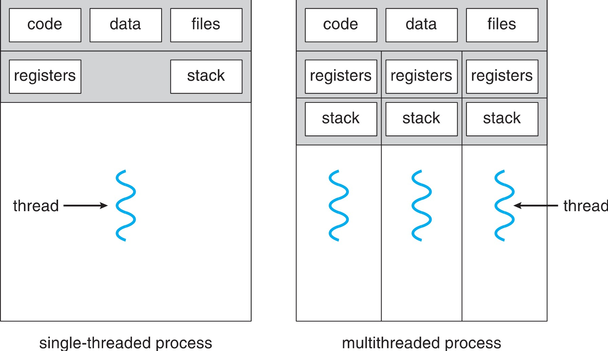
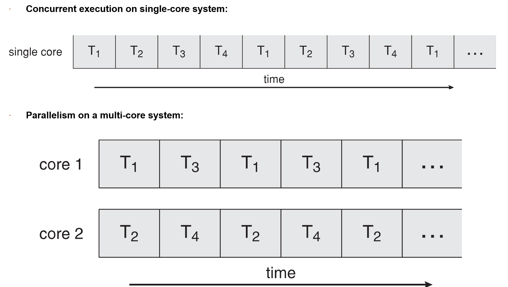
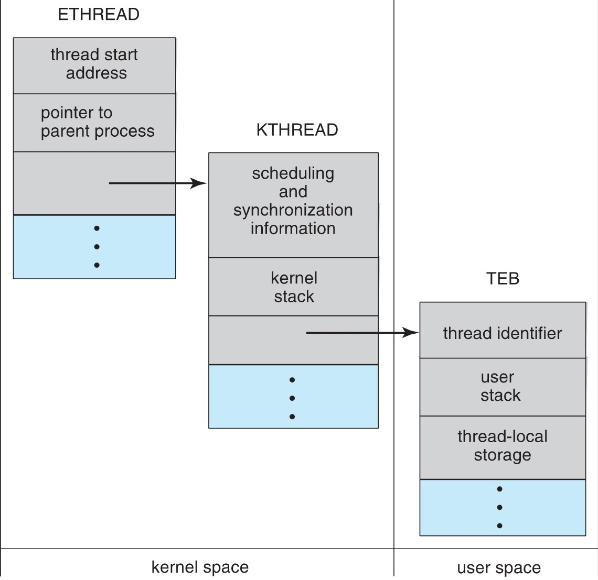
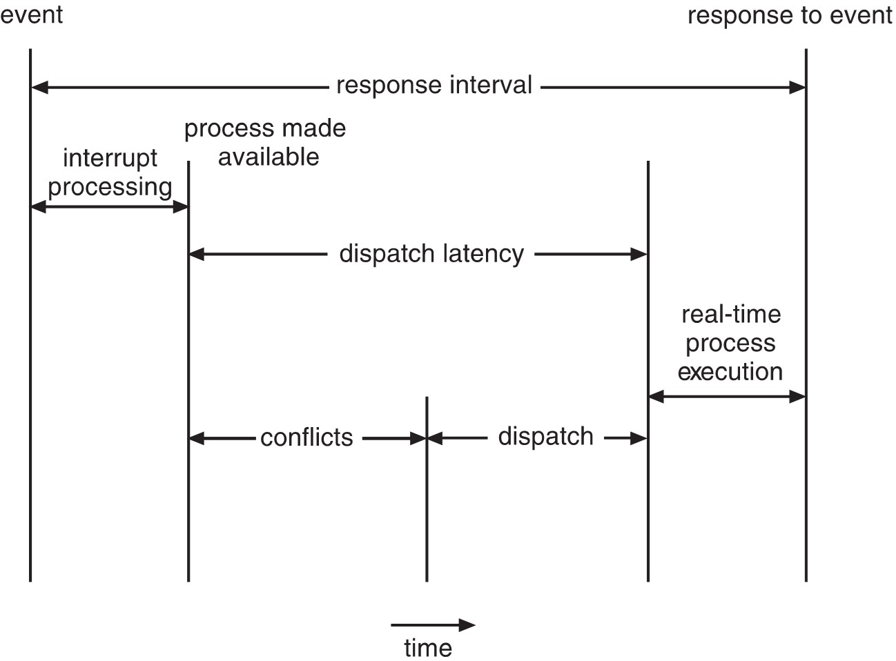

多线程编程、进程调度  

<!-- more -->

<!-- TOC -->

- [多线程编程](#多线程编程)
- [进程调度](#进程调度)

<!-- /TOC -->
# 多线程编程
**线程：**是CPU使用的一个基本单元。包括线程ID、程序计数器、寄存器组和堆栈。它与同一进程的其他线程共享代码段、数据段、和其他操作系统资源。
 
 ***
多线程编程优点：
* 响应性：部分阻塞或执行冗长操作是，仍可以继续执行；
* 资源共享：通过共享内存和消息传递共享资源。允许一个应用程序在同一地址空间内有多个不同的活动线程。
* 经济：进程创建所需内存和资源分配非常昂贵。
* 可伸缩性：并行运行。
* 
并行性：并行系统可以同时执行多个任务。多核系统。
并发性：并发系统支持多个任务，允许所有任务都取得进展。单核系统。

**多核编程**：
挑战：识别任务、平衡、数据分割、数据依赖、测试与调试、
数据并行：将数据分布于多个计算核上，并在每个核上执行相同的操作。
任务并行：将任务（线程）分配到多个核，每个线程都执行一个独特的操作。
***
**多线程模型**

两种不同的方法来提供线程支持：用户线程和内核线程。
**一对一模型**映射每个用户线程到一个内核线程。
**多对多模型**多路复用多个用户线程到同样数量或更少数量的内核线程。

**线程库**
线程库为程序员提供创建和管理线程的API。
POSIX Pthread可以提供用户级或内核级的库。
Windows线程库适用于Windows操作系统内核级线程库。
Java线程API允许线程在Java程序中直接创建和管理，通常采用宿主系统的线程库来实现。

**隐式多线程**：将多线程的创建和管理交给编译器和运行时库来完成。
* 线程池：在进程开始时创建一定数量的线程，并加到池中以等待工作。
* OpenMP:一组编译指令和API，用于编写C、C++、Fortran等语言的程序，支持共享内存下的并行编程。OpenMP识别并行区域。
* 大中央调度（GCD）：适用于Mac OS和IOS曹主席团。每块为一个独立单元，将块放置在调度对了上，GCD电镀块以便执行。
***
**多线程问题**
1. 系统调用fork（）和exec（）；
2. 信号处理：信号用于通知某个特定事件已经发生；
3. 线程撤销：在线程完成之前终止线程；异步撤销（可能不会释放系统资源）和延迟撤销；
4. 线程本地存储（TLS）：每个线程除共享进程数据之外的自己的数据；
5. 调度器激活：用户线程与内核线程之间的一种通信方案。内核提供一组虚拟处理器（LWP）给应用程序，应用程序可以调度用户线程到任何一个可用LWP。此外，内核应将有关特定事件通知应用程序。

**Windows线程**
其线程一般包括：线程ID、寄存器组、用户堆栈、私有存储区域、
线程的主要数据结构包括：
* ETHREAD：执行线程块
* KTHREAD：内核线程块
* TEB：线程环境块

***

# 进程调度

CPU调度的任务是从就绪队列中选择一个等待进程，并为其分配CPU。
CPU-I/O执行周期：锦程之星包括周期进行CPU执行和I/O等待。

I/O密集型程序：大量短的CPU执行。
CPU密集型程序：少量长的CPU执行。

抢占调度：能够在进程在就绪状态时进行调度；非抢占调度：进程一直使用，直到终止或切换到等待状态。
**调度程序**是一个模块，用来将CPU控制交给有短期调度程序选择的进程。功能包括：切换上下文；切换到用户模式；跳涨到用户程序的合适位置以便重新启动。

**调度准则**：CPU使用率、吞吐量、周转时间、等待时间、响应时间。

**调度算法**
1. 先到先服务FCFS：先请求CPU的进程首先分配到CPU。可以通过FIFO队列实现。非抢占。
2. 最短作业优先SJF：最短下次CPU执行。常用于长期调度。是最优的，平均等待时间最小。抢占或非抢占。
3. 优先级调度：主要问题是无穷阻塞或饥饿。阻塞：就绪但是等待CPU。解决方案：老化，即逐渐增加在系统中等待时间很长的进程的优先级。
4. 轮转调度RR：专门为分时系统设计。类似于FCFS但是增加了抢占以切换进程。CPU调度程序循环整个就绪队列，为每个进程分配不超过一个时间片的CPU。
5. 多级队列调度：将就绪队列分为多个单独队列，每个队列有自己的调度算法，队列之间采用固定优先级抢占调度。
6. 多级反馈队列调度：允许进程在队列之间迁移。将I/O密集型和交互进程放在更高优先级队列，等待过长的进程会被迁移到更高优先级队列。最通用的、最复杂的。

**线程调度**
用户级线程调度PSC：进程竞争范围。
内核级线程调度CSC：系统竞争范围。

**多处理器调度**
对称多处理与非对称多处理。
处理器亲和性：由于缓存的无效后重新填充的代价高。大多数SMP系统试图避免将进程从一个处理器移到另一处理器，师徒让一个进程运行在同一个处理器上。
负载均衡：试图将负载平均分配到SMP系统的所有处理器。

**多核处理器**
处理器的多线程有多种方法：粗粒度和细粒度的线程。
粗粒度的线程，线程一直在处理器上执行，知道一个长延迟事件发生（如内存停顿）。
细粒度的多线程在更细粒度的级别上（通常为指令周期的边界上）切换线程。细粒度系统的架构设计有线程切换的逻辑，其切换成本小。
***
**实时CPU调度**
软实时系统：不保证会调度关键实时进程；而只保证这类进程会优先于非关键进程。
硬实时系统：一个任务应在它的截止期限之前完成；在截止期限之后完成，与没有完成是一样的。

时间延迟：从事件发生到事件得到服务大的这段时间。
中断延迟：从CPU收到中断到中断处理程序开始的时间。要求中断禁用的时间非常短。
调度延迟：调度程序从停止一个进程到启动另一个进程所需的时间量。提供抢占式内核以降低调度延迟。

**单调速率调度**算法采用抢占的、静态优先的策略，调度周期性任务。优先级与其周期成反比。可以认为是最优的，如果一组进程不能由此算法调度，它不能由任何其他分配静态优先级的算法来调度。不能保证满足截止期限。
**最早截止期限优先调度**EDF：根据截止期限动态分配优先级。截止期限最早，优先级最高。理论上最佳，他可以调度进程，使得每个进程都可以满足截止期限的要求并且将CPU的利用率会是100%。EDF调度不要求周期性进程，要求进程在变成可运行时，应宣布它的截止期限。

**比例分享调度**：将处理器时间划分为股份，并为每一个进程分配一定数量的份额。采取准入控制策略。

**算法评估**
确定性模型：采用特定的预先确定的负荷，计算在给定负荷下每个算法的性能。
排队模型：已知到达率和服务率，可以计算使用率、平均队列长度、平均等待时间等。
仿真：仿真程序由一个代表时钟的变量；随着这个变量值的增加，模拟程序修改系统状态以便反应设备、进程和调度程序的活动。随着仿真的运行，表明算法性能的统计数据被收集并打印。
评估调度算法的唯一可靠技术是在实际系统上实现算法，并在实际环境中监视性能。
