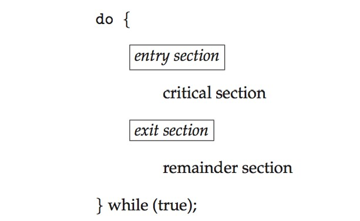

<font face="微软雅黑"> </font>
<center>同步、死锁 </center>

<!-- more -->
   
<center> [本文地址](https://tiandaochouqin1.github.io/OSC-Chapter6-7/) </center>
<!-- TOC -->

- [同步](#同步)
  - [互斥锁](#互斥锁)
  - [自旋锁spin lock](#自旋锁spin-lock)
  - [信号量](#信号量)
- [死锁](#死锁)

<!-- /TOC -->
# 同步
竞争条件：多个进程并发访问和操作同一数据，并且执行结果与特定访问顺序有关。
每个进程有一段代码，称为**临界区**，进程在执行该区时可能修改公共变量、更新一个表、写一个文件等。当一个系统在临界区内执行时，其他进程不允许在他们的临界区内执行。


临界区问题的解决方案应满足如下三条要求：**互斥、进步、有限等待。**
***
**Perterson解决方案**：适用于两个进程交错执行临界区和剩余区。共享 int turn；Boolean flag[2]

```
do { 
    flag[i] = true; 
    turn = j; 
    while (flag[j] && turn == j); 
        critical section 
    flag[i] = false; 
        remainder section 
} while (true); 

```

**硬件同步**。。。

## 互斥锁

进程进入临界区的时候得到锁，退出临界区的时候释放锁。需要忙等待。

```
while (!available) 
    ; /* busy wait */ 
available = false;; 
} 
release() { 
available = true; 
} 

do { 
acquire lock
    critical section
release lock 
    remainder section 
} while (true); 

```
## 自旋锁spin lock

进程不停地旋转，以等待锁变得可用。当进程在等待锁时，无上下文切换。
（1）spin lock是一种死等的锁机制。当前的执行thread会不断的重新尝试直到获取锁进入临界区。

（2）只允许一个thread进入。semaphore可以允许多个thread进入，spin lock不行，一次只能有一个thread获取锁并进入临界区，其他的thread都是在门口不断的尝试。

（3）执行时间短。由于spin lock死等这种特性，因此它使用在那些代码不是非常复杂的临界区。

（4）可以在中断上下文执行。由于不睡眠，因此spin lock可以在中断上下文中适用。

[进程上下文与中断上下文](https://www.cnblogs.com/alantu2018/p/8461094.html)
[Linux内核同步机制之（四）：spin lock](http://www.wowotech.net/kernel_synchronization/spinlock.html)


## 信号量
功能类似于互斥锁。能提供更为高级的方法，以便进程能够同步活动。信号量S是一个整型变量，只能通过两个标准原子操作：wait()和signal()。

    wait (S) { 
        while (S <= 0)
        ; // busy wait
        S--;
    }
    signal (S) { 
        S++;
    }


    Consider P1  and P2 that require S1 to happen before S2
    P1:
    S1;
    signal(synch);
    P2:
    wait(synch);
    S2;

**信号量的实现**：当wait()发现信号量值不为正时，阻塞自己-将进程放入到与信号量相关的等待队列。signal()从等待进程链表上取走一个进程，并加以唤醒。可以克服忙等待。

    typedef struct{ 
    int value; 
    struct process *list; 
    } semaphore; 
    wait(semaphore *S) { 
    S->value--; 
    if (S->value < 0) {      add this process to S->list; 
        block(); 
    } 
    }
    signal(semaphore *S) { 
    S->value++; 
    if (S->value <= 0) {      remove a process P from S->list; 
        wakeup(P); 
    } 
    } 
    
**死锁：**两个或多个进程无限等待一个事件，而该事件只能由这些等待进程之一来产生。

**优先级反转问题:**由于多进程共享资源，具有高优先级的进程被低优先级进程阻塞，反而使具有中优先级的进程（不需要共享资源）抢先执行。
优先级继承协议：所有正在访问资源的进程获得需要访问它的更高优先级进程的优先级，直到用完相关资源。

**哲学家就餐问题**

**管程**：确保每次只有一个进程在管程内处于活动状态。管程类型属于ADT类型，提供一组由程序员定义的、在管程内互斥的操作。可防止时序出错。


# 死锁
[参考文章](https://www.cnblogs.com/lca1826/p/6627584.html)
四个必要条件：互斥、占有并等待、非抢占、循环等待。同时成立则引起死锁。

资源分配图：每个资源类型刚好只有一个实例，那么有环意味着已经出现死锁。每个资源类型由多个实例时，环时死锁存在的充分非必要条件。

**死锁预防**：确保至少有一个必要条件不成立。
* 互斥：互斥条件必须成立
* 持有且等待：1）进程执行前申请并获得所有资源；2）允许进程尽在没有资源时才可申请资源。
* 无抢占：如果一个进程持有资源并申请另一个不能立即分配的资源，那么它现在分配的资源都可被抢占。通常用于状态可以保存和恢复的资源。
* 循环等待：对所有资源类型进行完全排序，每个进程只能按递增顺序申请资源。
缺点：设备使用率低和系统吞吐量低。
***

**死锁避免：**操作系统事先得到有关进程申请资源及每个进程将来申请和释放的资源。
安全序列：系统按照一定顺序为每个进程分配资源，仍然能够避免死锁，那么系统的状态就是安全的。
资源分配图算法：对于每种资源类型只有一个实例。只有在进程P的所有边都为需求边时，才允许将需求边P→R增加到图中。
银行家算法：每种资源由多个实例。
***

**死锁检测**：单个实例和多个实例两种。
**死锁恢复**
1. 进程终止：终止所有、一次终止一个。
2. 资源抢占：选择牺牲进程、回滚、饥饿问题。

***

