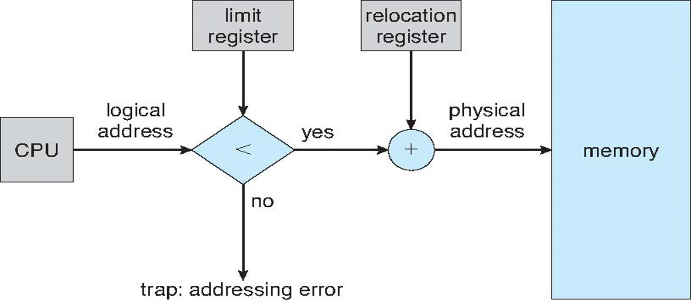
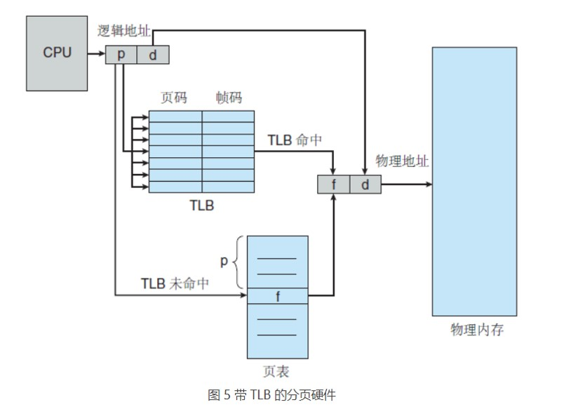

 

内存管理策略、虚拟内存管理 

<!-- more -->

 [本文地址](https://tiandaochouqin1.github.io/OSC-Chapter8-9/) 

<!-- TOC -->

- [内存管理策略](#%e5%86%85%e5%ad%98%e7%ae%a1%e7%90%86%e7%ad%96%e7%95%a5)
- [虚拟内存管理](#%e8%99%9a%e6%8b%9f%e5%86%85%e5%ad%98%e7%ae%a1%e7%90%86)

<!-- /TOC -->
# 内存管理策略
**背景**
内存是由一个很大的字节数组来注册，每个字节都有各自的地址。
CPU可以直接访问的通用存储只有内存和处理器内置的寄存器。
CPU内置寄存器可以再一个CPU时钟周期内完成访问。完成内存的访问需要多个CPU时钟周期、在CPU和内存之间，即在CPU之上增加高速缓存。

确保每个进程狗有一个单独的内存空间。基地址寄存器含有最小合法物理内存地址；界限地址寄存器制定了范围的大小。

**地址绑定**
源程序中的地址通常是用符号表示，编译器将这些符号地址绑定到可重定向地址，链接程序或加载程序再将可重定位地址绑定到绝对地址。
**逻辑地址**：CPU生成的地址。
**物理地址**：内存单元看到的地址（即加载到内存地址寄存器）的地址。
从虚拟地址到物理地址的运行时映射时由内存管理单元的硬件设备来完成。
基地址寄存器这里称为重定位寄存器。

**动态加载**：一个程序只有在调用时才会被加载。
**动态链接**：程序在运行时才会被夹在。

**交换**：进程可以暂时从内存交换到备份存储，当再次执行时再调回内存。交换有可能让所有进程的总物理地址空间超过真实系统的物理地址空间，从而增加了系统的多道程序度。
***

**连续内存分配**
每一个进程位于一个连续的内存区域，与包含下一个进程的内存相连。

**内存保护：**重定位寄存器含有最小的物理地址值；界限寄存器含有逻辑地址的范围值。

**动态存储分配**：首次适应； 最优适应； 最差适应。
外部碎片：总的可用内存之和可以满足请求但并不连续，其存储被分成了大量的小孔。
解决方法之一是紧缩：移动内存内容； 二是允许进程的逻辑空间是不连续的。
内部碎片：进程所分配的内存比所需的要大。
***

**分段**
分段是支持用户视图的内存管理方案。逻辑地址空间是由一组段组成。
段表实际上是基址寄存器值和界限寄存器值的对的数组。
***
**分页**
实现分页的**基本方法**实际将物理内存分为固定大小的块，称为帧或页帧。而将逻辑内存也分为同样大小的块，称为页或页面。
分页本身是一种动态地重定位。每个逻辑地址由分页硬件绑定为某个物理地址。
采用分页的方案不会产生外部碎片：每个空闲帧都可以分配给需要它的进程。
**转换表缓冲区TLB**：专用的、小的、查找快速的高速硬件缓冲。TLB是关联的高速内存。只包含少数的页表条目。

分页环境下的内存保护是通过与每个帧关联的保护位来实现的。
共享页：可重入代码，即不能自我修改的代码，在执行期间不会改变。
***
**页表结构**
* 分层分页：两层分页法。
* 哈希页表：处理大于32位的地址空间。虚拟地址的虚拟页码哈希到哈希表。
* 倒置页表：对于每个真正的内存页或帧，倒置页表才会有一个条目。
***

# 虚拟内存管理
虚拟内存能能够将较大的逻辑地址空间映射到较小的物理内存。
虚拟内存允许运行极大的进程，提高多道程度，提高CPU利用率。
虚拟内存允许多进程共享系统库和内存。通过虚拟内存，可以采用写入时复制进行高效的进程创建，父子进程共享实际的内存页面。

虚拟内存的实现通常采用请求调页——仅在需要时才加载页面。
交换器操纵整个进程，掉页程序只涉及需要的页面。
请求调页的关键要求是在缺页错误后重新启动任何指令的能力。

**写时复制**通过允许父进程与子进程最初共享相同的页面来工作。

***

**页面置换**
如果没有空闲帧，则查找当前不在使用的一个帧，并释放它。
**页面置换**是请求调页的基础。它完成了逻辑内存和物理内存之间的分离。
内存引用的串称为**引用串**。
实现请求调页需要解决两个主要问题：**帧分配算法和页面置换算法**。

* FIFO页面置换：
* 最优页面置换：置换最长时间不会使用的页面，需要引用串的未来知识。
* LRU页面置换：最近最少使用算法。
    * 计数器：每次内存引用递增时钟。
    * 堆栈：最近最少使用的页面在底部，可使用具有首尾指针的双向链表。
    除了标准的TLB寄存器没有其他辅助硬件，这两种LRU都不可能实现。
* 近似LRU页面置换：采用引用位
    * 额外引用位算法：8位字节
    * 第二次机会算法：其基本算法是FIFO，采用循环队列。
    * 增强型第二次机会算法：引用位与修改位的有序对。
* 基于计数的页面置换：最不经常使用LFU和最经常使用MFU。
* 页面缓冲算法：保留一个空闲帧缓冲池。出现缺页错误时，选择一个牺牲帧；在写出牺牲帧之前，所需页面就读到来自缓冲池的空闲帧。
***

**帧分配**：平均分配比例分配。分配可以是固定的，此时采用局部页面置换算法；也可以是动态地，此时采用全局置换。

**工作集模型**假定进程执行的局部性。工作集是当前局部所有页面的集合。
如果一个进程没有足够的内存用于工作集，则会发生抖动。为进城提供足够的内存以避免抖动，可能需要进程交换和调度。

**内存映射文件功能**允许文件I/O作为常规内存访问。win32API通过文件的内存映射来实现共享内存。

内核进行通常需要物理连续页面来分配内存。
伙伴系统允许内核进程按2的幂大小来分配。
slab分配器允许从由slab组成的cache上来分配，每个slab由若干物理连续的页面组成。没有因碎片而引起内存浪费；可以快速满足内存要求。

除了页面置换和帧分配的主要问题之外，请求调页的正确设计还需要考虑：预先读取、页面大小、TLB范围、倒置页表、程序结构、I/O联锁和页面锁定等其他问题。
***
